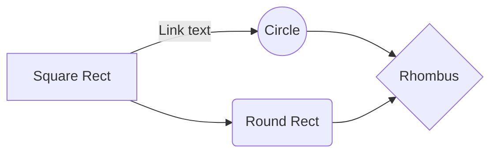

# GoPasar project

This project is building an e-commerce web application, the main product domain is going to be **agricultural products and tools**.

## Technology used
|Technology|Purpose|Official website|
|--|--|--|
| ReactJS | Frontend web | [https://reactjs.org/](https://reactjs.org/) |
| Redux | State management | [https://react-redux.js.org/introduction/quick-start](https://react-redux.js.org/introduction/quick-start) |
| Webpack | Frontend module bundler | [https://webpack.js.org/concepts/](https://webpack.js.org/concepts/) |
| Django | App Backend | [https://docs.djangoproject.com/en/3.0/](https://docs.djangoproject.com/en/3.0/) |
| Django REST Framework | REST API | [https://www.django-rest-framework.org/](https://www.django-rest-framework.org/) |
| MySQL | Database | [https://dev.mysql.com/doc/](https://dev.mysql.com/doc/) |
| Google Cloud Platform | App hosting and cloud database | [https://cloud.google.com/docs](https://cloud.google.com/docs) |

## Project folder structure
```
gopasar-proejct/
├── frontend/	-- ReactJS app folder
	├── src/ 					-- development folder
	├── static/frontend/		-- to store webpack module
	├── templates/frontend/		-- to store html template
	└── views.py				-- connect template to URL
├── gopasarapp/
	├── settings.py				-- Django app settings
	└── urls.py					-- Main URL router
├── marketplace/	-- Marketplace models, API, tests
├── static/			-- Project static assets
├── users/			-- Custom user model, authentication logic
└── requirements.txt -- Python dependency file, use pip to install
```

## Start backend development

## Start frontend development

## Flow Chart


